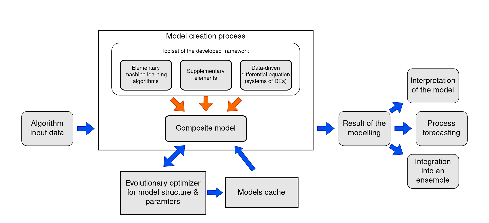

# DynamicModelDesign

This repository contains the library for dynamic data-driven identification for supercomputer implementation of composite models under uncertainty

# How to run benchmarks

# Usage
1. Install all dependencies needed for running with `pip install -r requirements.txt`
2. Run with `python benchmark.py`

### Changeable parameters
All the parameters needed to tune the benchmark exists in `benchmark.py` file.
Affects benchmark type:
* `benchmark_number` variable of global scope. Corresponds to the testable function-benchmark.
* Values of `examples_dct` variable of global scope. Matches the parameters in corresponding functions.

Affects benchmark duration:
* `timeouts` variable inside testable functions except `dummy_time_check`. Means `timeout` parameters for training process.
* `mean_range` inside `_run` function. Means averaging the result of identification by running it with the specified number of times.

# Acknowledgement

The development is financially supported by the Ministry of Science and Higher Education, Agreement \#075-15-2020-808.

# How to cite

Derevitskii I. V. et al. Hybrid Bayesian Network-Based Modeling: COVID-19-Pneumonia Case //Journal of Personalized Medicine. – 2022. – Т. 12. – №. 8. – С. 1325.

Improvement of Computational Performance for Evolutionary AutoML in Heterogeneous Environment (in press)
